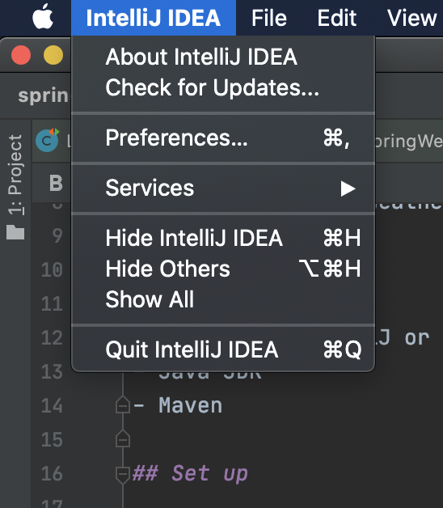
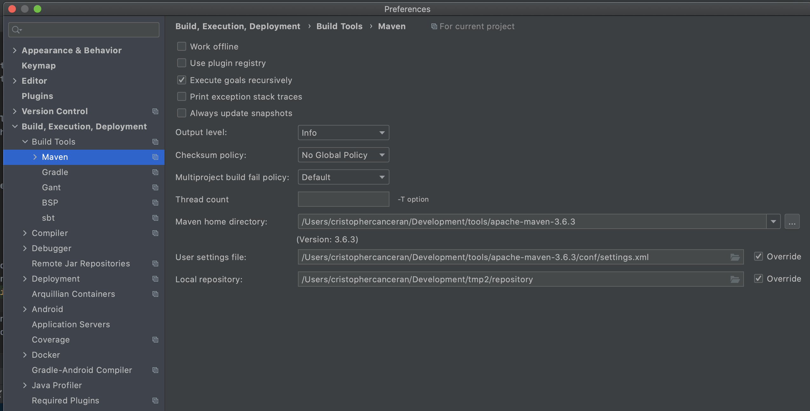
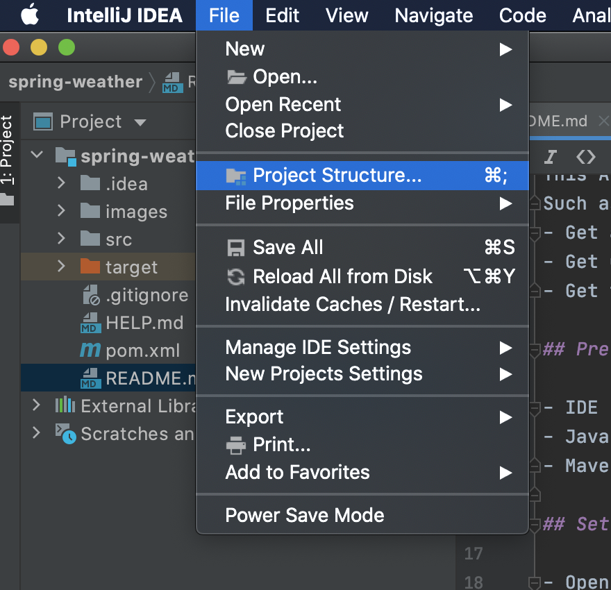
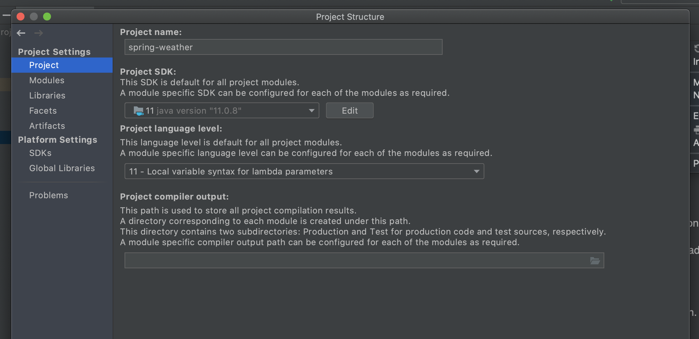
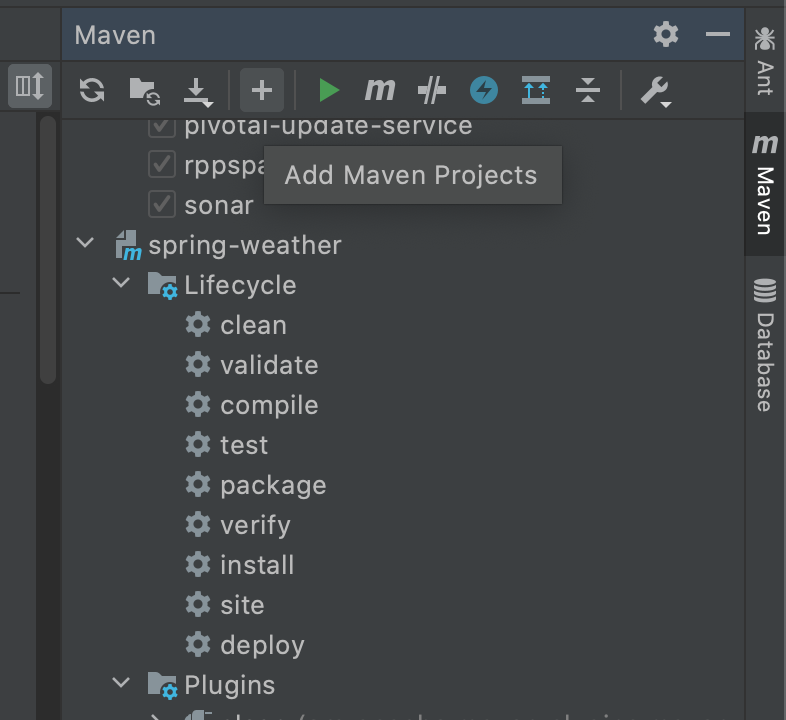
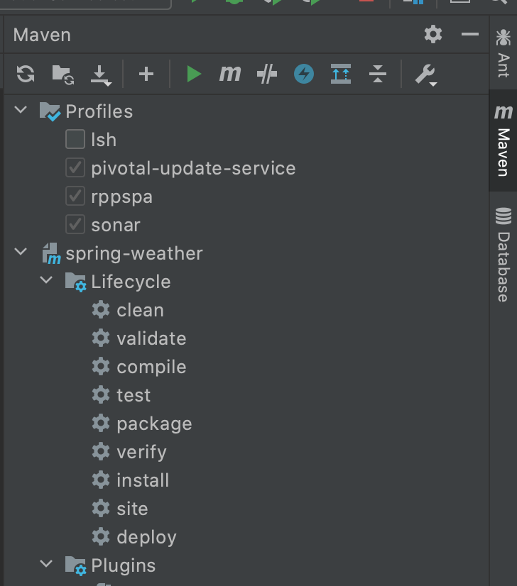
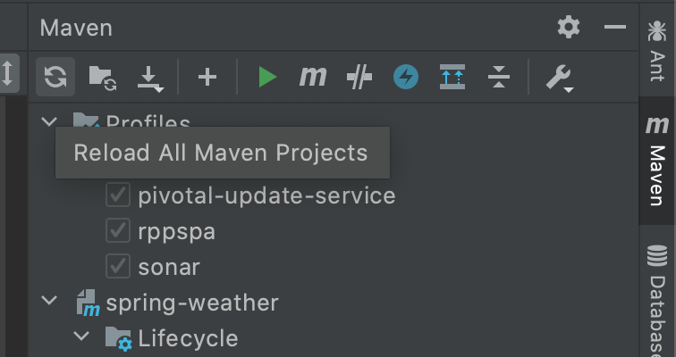
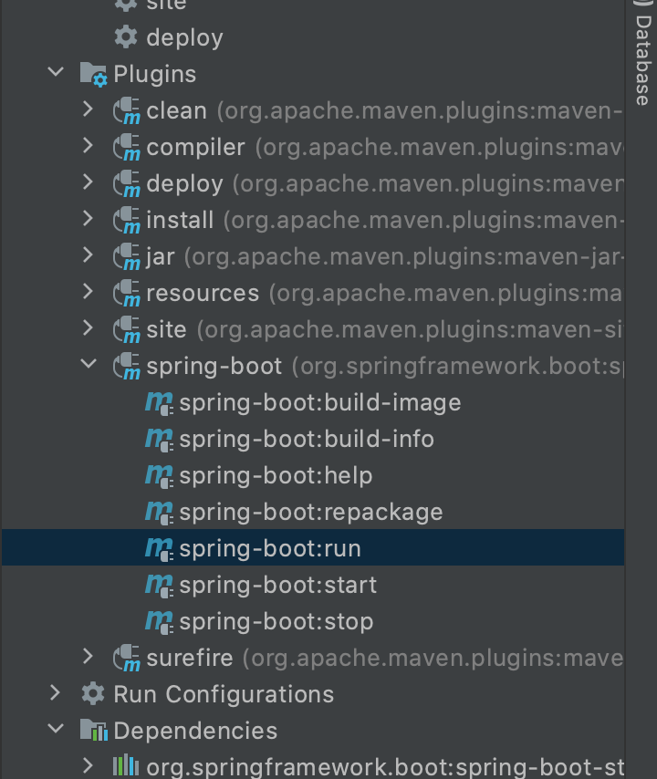

# Simple Weather API

This project is an API Application and use in the Simple Web Weather Widget Application.
This API returns all the data that needs in the Weather Application.
Such as :
- Get all cities in Australia.
- Get Geocode of the specific location.
- Get the current weather of the specific location.

## Pre-requisite

- IDE (like intelliJ or eclipse)
- Java JDK
- Maven
 
## Set up (using IntelliJ)

- Open this application with your IDE.
- To setup you maven. Go to IntelliJ IDEA -> Preferences

- Then setup your maven here.

- Then next thing is making sure that you configured you java. Go to File->Project Structure

- Then check your java here.

- Next is we will add this application as Maven Project. 
To do that click the + button and browse the pom.xml.

- Then after the run the maven clean and then verify.

- Then last is to Reload all Maven Projects

## Start the Application
- In your Terminal you can run `mvn spring-boot:run`
- Or you can use maven plugins 

## Postman API Collections
Get all available endpoints imported to you postman.
- https://www.getpostman.com/collections/0c27ad4e7a127491e63e